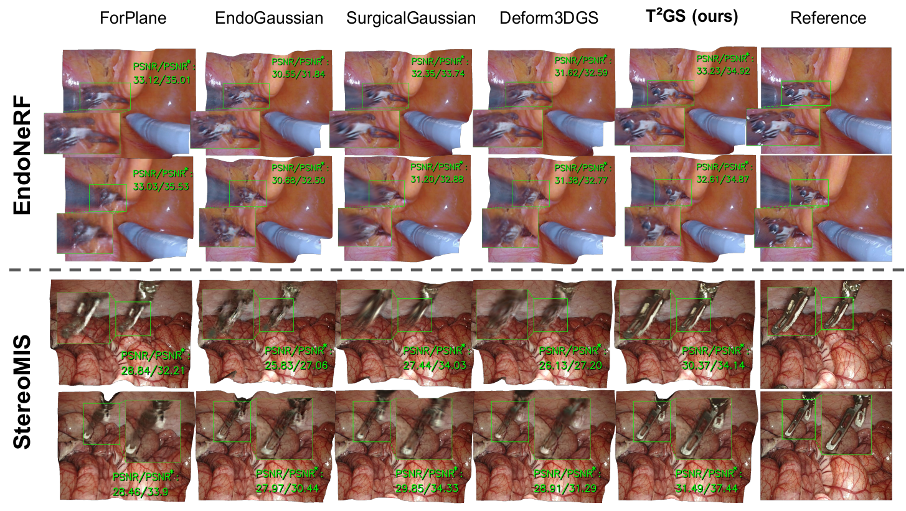
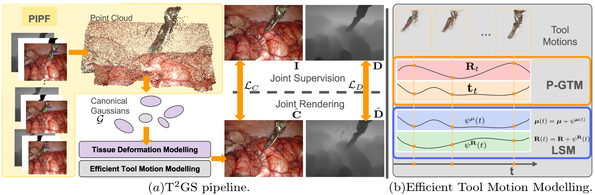

# T2 GS: Comprehensive Reconstruction of Dynamic Surgical Scenes with Gaussian Splatting

Official code implementation for [T2 GS](https://link.springer.com/chapter/10.1007/978-3-032-05114-1_57), a Gaussian Splatting based framework for surgical scene reconstruction.

> [T2 GS: Comprehensive Reconstruction of Dynamic Surgical Scenes with Gaussian Splatting](https://link.springer.com/chapter/10.1007/978-3-032-05114-1_57)
> Jinjing Xu, Chenyang Li, Peng Liu, Micha Pfeiffer, Liwen Liu, Reuben Docea, Martin Wagner & Stefanie Speidel
> MICCAI2025 


# To-Do List

- [x] Environment setting up
- [x] Dataset preparation
- [x] Training / Testing / Evaluation
- [ ] Release initialised tool poses generation script


## Rendering Results

<p align="center">
  
</p>

Visualisation on samples from EndoNeRF and StereoMIS. 

## Pipeline

<p align="center">
  
</p>
Fig. 1: Overview. In Fig.(a), we introduce the proposed **complete pipeline**, containing: 1) Gaussian initialization. 2) Deformation field modelling. 3) Joint rendering of composed gaussian. 4) Supervision. We detailed **Effecient Tool Motion Modelling (ETMM)** in Fig.(b).

The proposed framework supports both **comprehensive reconstruction** (reconstructing tissue and tools together) and **tool-only reconstruction** (reconstructing only surgical tools).


## Environment setup

We follow similar environment setting up as Deform3DGS.

```bash
conda create -n TTGS_env python=3.7 
conda activate TTGS_env
pip install -r requirements.txt
pip install -e submodules/depth-diff-gaussian-rasterization
pip install -e submodules/simple-knn
```

Note: The RAFT submodule is included for optic flow based stereo depth estimation as conducted in this [work](https://github.com/aimi-lab/robust-pose-estimator). The depth-diff-gaussian-rasterization module differs from the one used in Deform3DGS, the one we used here additionally supports [alpha rendering](https://github.com/zju3dv/street_gaussians).


## Datasets 

We use 2 clips `pulling` and `cutting` from [EndoNeRF](https://github.com/med-air/EndoNeRF) , and manually extracted 2 clips `P2_8_16241_16309` and `P2_7_171_251`, which captures *moving tools + deforming bowel* and  *moving tools + breathing liver*, from [StereoMIS](https://zenodo.org/records/7727692) to verify our method. 

**EndoNeRF**

To use the EndoNeRF dataset, please download the [dataset](https://forms.gle/1VAqDJTEgZduD6157) and organize the data according to the [guideline](https://github.com/med-air/EndoNeRF.git). We regenerated depth image following the [workflow](https://github.com/aimi-lab/robust-pose-estimator) to obtain comprehensive stereo depth (the original ones provided in the dataset has missing depth in tool area). 

Then we regenerated tool masks with an [interactive Video Segmentation Tool](https://github.com/mbzuai-metaverse/XMem2) (the original ones provided in the dataset is not instance segmented), per tool pose with `get_cotracker_poses.sh` for tool pose initialisation. 

We provided processed EndoNeRF clips [here](https://drive.google.com/drive/folders/1ia4EvI67haTQ0__oqCLsuqLlbzpLzuLw?usp=sharing).

**StereoMIS**

To use the StereoMIS dataset, please follow the [original work](https://github.com/aimi-lab/robust-pose-estimator) to preprocess the dataset to obtain stereo depth, and run the provided script `stereomis2endonerf.py` to format the data as the above EndoNeRF dataset. 

Then we regenerated tool masks with an [interactive Video Segmentation Tool](https://github.com/mbzuai-metaverse/XMem2) (the original ones provided in the dataset is not instance segmented), and generate the per tool pose with `get_cotracker_poses.sh` for tool pose initialisation. 

We provided extracted two processed StereoMIS clips (`P2_8_16241_16309` ; `P2_7_171_251`) [here](https://drive.google.com/drive/folders/1ia4EvI67haTQ0__oqCLsuqLlbzpLzuLw?usp=sharing).


*After processing, the data structure is as follows*:

```
datasets/
├── EndoNeRF/
│   ├── cutting/
│   │   ├── depth/
│   │   ├── images/
│   │   ├── masks_merged/
│   │   ├── masks_obj1/
│   │   ├── masks_obj2/
│   │   ├── masks_obj3/
│   │   ├── ObjPoses_rel_CoTracer_query_bi_queryGenMaskframe-000026_ptsN1000_PnP_LMrf1_masks.pt
│   │   ├── ObjPoses_rel_CoTracer_query_bi_queryGenMaskframe-000026_ptsN1000_PnP_LMrf1_masks_obj1.pt
│   │   ├── ObjPoses_rel_CoTracer_query_bi_queryGenMaskframe-000026_ptsN1000_PnP_LMrf1_masks_obj2.pt
│   │   ├── ObjPoses_rel_CoTracer_query_bi_queryGenMaskframe-000026_ptsN1000_PnP_LMrf1_masks_obj3.pt
│   │   └── pose_bounds.npy
│   └── pulling/
│    	└── ...
└── StereoMIS_processed/
    ├── P2_7_171_251/
    │   ├── depth/
    │   ├── images/
    │   ├── masks_merged/
    │   ├── masks_obj1/
	│   ├── masks_obj2/
	│   ├── ObjPoses_rel_CoTracer_query_bi_queryGenMaskframe-000026_ptsN1000_PnP_LMrf1_masks.pt
│   ├── ObjPoses_rel_CoTracer_query_bi_queryGenMaskframe-000026_ptsN1000_PnP_LMrf1_masks_obj1.pt
	│   ├── ObjPoses_rel_CoTracer_query_bi_queryGenMaskframe-000026_ptsN1000_PnP_LMrf1_masks_obj2.pt
	|   └── pose_bounds.npy
    └── P2_8_16241_16309/
        └── ...
```


## Training

To train T2 GS on a given clip, run the following command. We gave example usage on `pulling` clip from EndoNeRF:

```bash
python -u train.py \
	--port 6018 \
	--method ttgs \
	--configs arguments/default.py \
	-s /datasets_path/EndoNeRF/pulling \
	--expname /path/to/save/exp_results/pulling/ttgs 
```

Please make changes of `compo_all_gs_ordered_renderonce` parameter in `arguments/general_default.py` for either **comprehensive reconstruction** / **tool only reconstruction**. Specifically, this is controlled by `compo_all_gs_ordered_renderonce` parameter:

- `[]` (empty list): Comprehensive reconstruction (tissue + all tools)
- `['obj_tool1', 'obj_tool2']`: Tool only reconstruction(specify which tools to reconstruct). We report *reconstructing all the present tools* in the paper, in this case this value needs to be set as *['obj_tool1', 'obj_tool2']*  for the clips `pulling`, `P2_7_171_251`  and `P2_78_16241_16309`,  and set as *['obj_tool1', 'obj_tool2', 'obj_tool3']* for the clip `cutting`.

To distinguish the trained models of one clip under comprehensive reconstruction / tool only reconstruction mode, an expname appendix *ALL* / *ToolOnly* will be used to create subdir under the given `--expname`.


## Testing

To render the trained model, provide the directory of of the trained model and run the following example command. We gave example usage on rendering the comprehensive reconstruction of  `pulling` clip from EndoNeRF:

```bash
python -u render.py \
	--model_path /path/to/save/exp_results/pulling/ttgs/ALL \
	--skip_video \
	--skip_train \
	--configs "arguments/default.py" 
```

**Options:**

- `--model_path`:  This parameter should be set  as the `--expname` appended with subdir  *ALL* / *ToolOnly* depending on which is intended to render.
- `--skip_train`,  `--skip_video`: Skip rendering for test sets only.
- `--offline_target`:(optional)  Specify specific components to render e.g., `tissue`, `obj_tool1 obj_tool2`. By default rendering all components it has searched in the specified model_path.


## Evaluation

To evaluate the reconstruction quality and save the metrics, we give examples as below.

To evaluate on EndoNeRF comprehensive reconstruction, please set `--method_varient_subdir` as *ALL*:

```bash
 python -u metrics.py \
     --exp_root /path/to/save/exp_results \
     --save_root metric_results/metrics \
     --seq_subdir pulling cutting  \
     --method_varient_subdir ALL 
```

To evaluate on StereoMIS tool only reconstruction, please set `--method_varient_subdir` as *ToolOnly*:

```bash
 python -u metrics.py \
     --exp_root /path/to/save/exp_results \
     --save_root metric_results/metrics \
     --seq_subdir P2_7_171_251 P2_8_16241_16309 \
     --method_varient_subdir ToolOnly 
```


## Acknowledgements

This repo borrows source code from [Deform3DGS](https://github.com/jinlab-imvr/Deform3DGS) and [Street Gaussians](https://github.com/zju3dv/street_gaussians). We would like to acknowledge these great prior works for inspiring our research.

## Citation

If you find this code useful for your research, please use the following BibTeX entry:

```bibtex
@inproceedings{xu2025ttgs,
    title={T2 GS: Comprehensive Reconstruction of Dynamic Surgical Scenes with Gaussian Splatting},
    author={Xu, Jinjing and Li, Chenyang and Liu, Peng and Pfeiffer, Micha and Liu, Liwen and Docea, Reuben and Wagner, Martin and Speidel, Stefanie},
    booktitle={International Conference on Medical Image Computing and Computer-Assisted Intervention (MICCAI)},
    year={2025}
}
```
